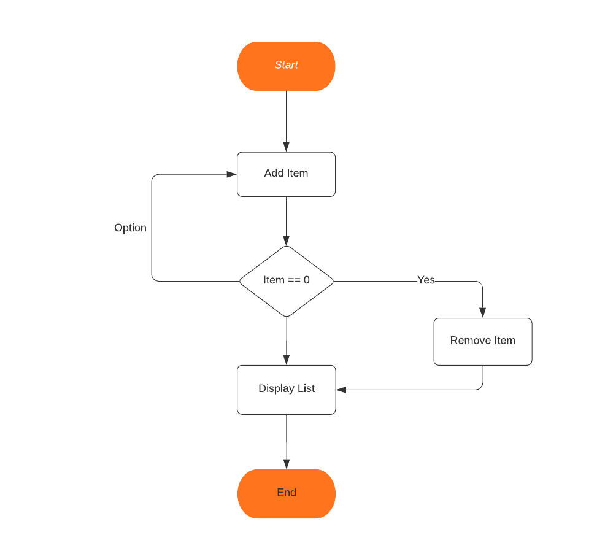
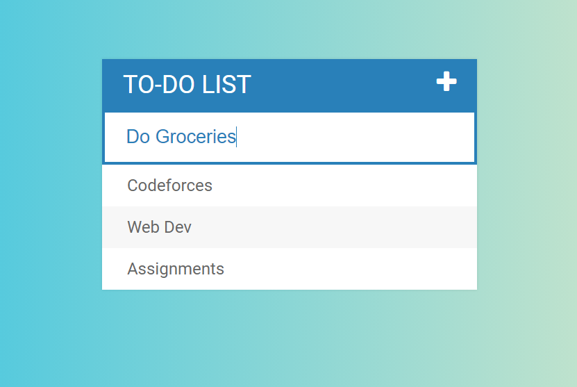
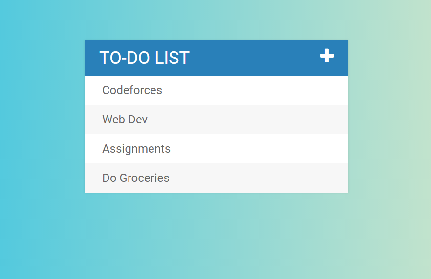

# Todo_List

Overview:

This is a static web page which allows you to add/remove item in a todo list.

LiveLink:

https://shivam3009.github.io/Todo_List/

FlowChart:

Input:

Output:

Novelty:

1. Build using HTML, CSS and JavaScript.
2. Easy to use.
3. User Friendly Interface.

